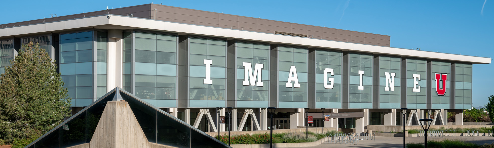

# University of Utah - Marriott Library - Apple Infrastructure
---

### Notable Repositories
---

### Links & Resources
---

##### [JNUC 2021 - Turn 1000 clicks into 1 with python-jamf and jctl (YouTube)](https://youtu.be/2YLriNwyP3s)
> This session will introduce `python-jamf` and `jctl`, give some usage examples, show how it works internally, and show how easy it is to add your own functionality to perform and automate any repetitive and complex task you want.

##### [MacAdmins Slack Channel](https://macadmins.slack.com/archives/C01C8KVV2UD)
> If you have additional questions, or need more help getting started, post a question on the MacAdmin's Slack #jctl channel.

##### [University of Utah -  MacAdmins Blog](https://apple.lib.utah.edu)
> The University of Utah, MacAdmins Meeting is held monthly virtually on the 3rd Wednesday of each month at 11 AM Mountain Time. Presentations cover Apple technology and integration in a heterogeneous university enterprise environment.

##### [University of Utah - MacAdmins Archived Presentations](https://stream.lib.utah.edu/index.php?c=browse&m=results&q=%22mac+manager%22&cat=&sort=newest)

> Archived University of Utah, MacAdmins presentation and slides.

